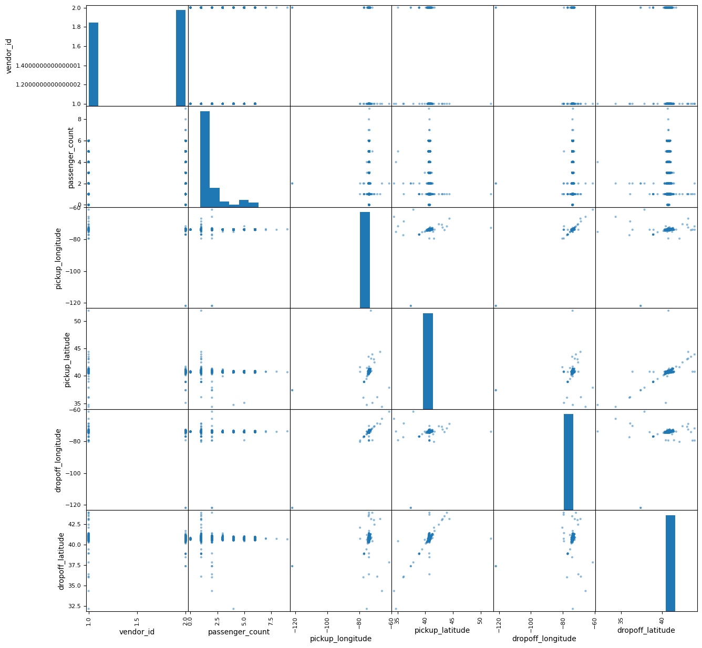
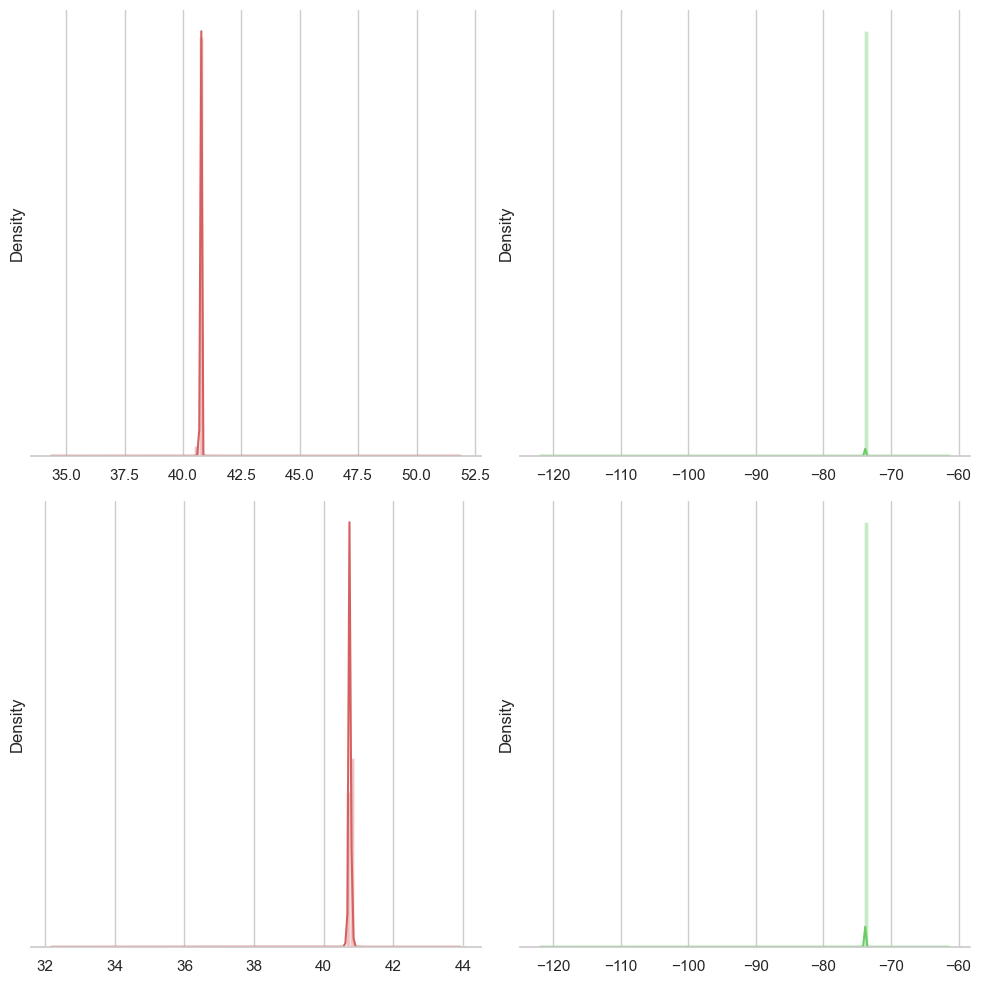
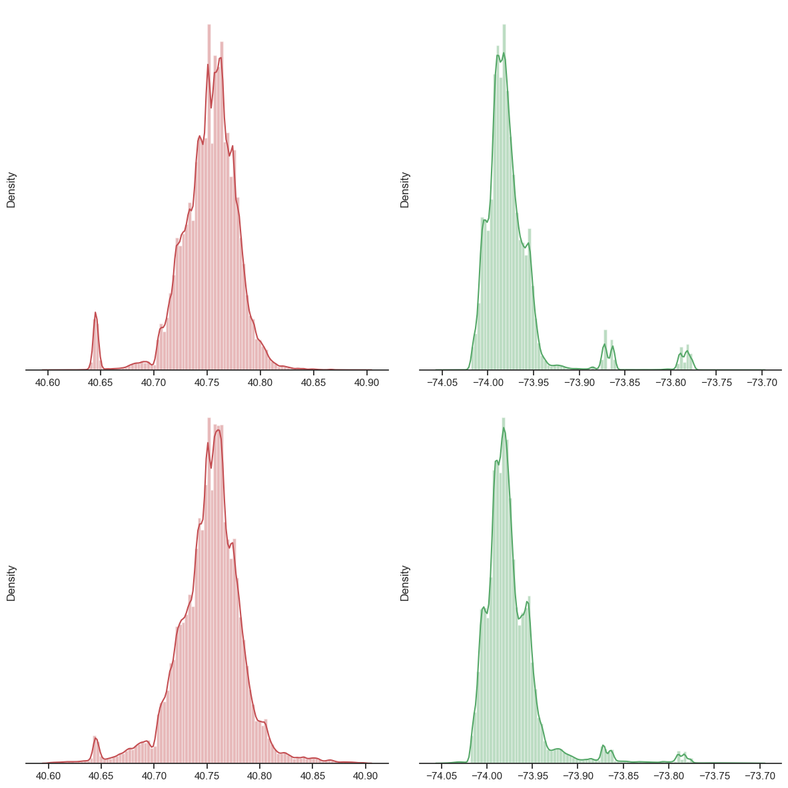

# NYC cab trips duration 
## Machine learning for transport analysis and prediction. Predict trip duration of NYC cabs.
[BLog link](https://blog.iaac.net/machine-learning-model-to-predict-nyc-cabs-trip-duration/) 
Machine Learning in Python  
tools: Jupyter Notebook, Python, Nympy + Pandas + Datetime + Plotly.express + Matplotlib + Math + Seaborn + Bokeh + Scikit-learn.

## Question
How long do New York City cabs take to travel?

## What I learned: 
- Data mining and aggregaion
- Data manipulation, cleaning outlayers and preparation for analysis
- Fitting data to ML model
- Data analysis and visualization
- Machine learning
  
## Methodology
1. Data preparation includes steps: removal of outlayers of passengers = 0 and > 7, removal of trips longer 3 hours (10800 s), removal of trips beyond the boundary of NYC (-74.03 to -73.75, 40.63 to 40.9).
2. Evaluation of the share of filtered trips correlates to 99.85%. After that we have to count the difference between pickup and dropoff points of geo-coordinates and add them to the dataframe, and to calculate a distance of 1 degree in km on specific latitude with by Haversine formula (haversine(θ) = sin²(θ/2)). At the latitude of NYC = 40.5, one degree is equal to 84553 m, and one geo-minute is equal to 1.42126. After that we reduce rows by distance larger one minute, get month, day, hour, day of week from the pickup datetime column, split the dataset to train and test parts.
Data testing.
3. The prediction with Linear regression returns the result of the Median absolute error in seconds = 291.0918991901533.
4. Next step is to load RandomForest regression and fit the model, load test of the absolute metric error for RandomForest regression, and get prediction for the full dataset.
Evaluating prediction accuracy.
5. R2 score for the prediction evaluates the ratio of 0.7957444370115131.
6. In order to improve the trained model further we could add more data about weather conditions, data traffic jams, clustering by zipcodes.

## Code
- [Code](Romanix_finsubmission2_term_randomforest2.ipynb)
- [Trained model](submission_Romanix.csv)

## Data visualization and analysis
### Pearson chart to identify outlayers in time-related and geography-related data for data cleaning

### Data Visualization of pickup and dropoff geo-coordinates with sns distplot that proves existing outlayers in both directions. 
 
### Data Visualization  of pickup and dropoff geo-coordinates with sns distplot after removal of remote geo-coordinates and framing the dataset to the NYC boundaries.
 
### Data Visualization of pickup and dropoff of cab clients by vendors type.
 

